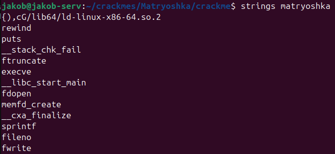
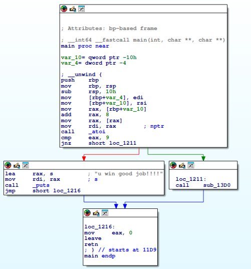

## Infos
- **Crackme Author: iamwololo**  
- **Crackme Link: https://crackmes.one/crackme/68ff42b82d267f28f69b78c8**  
- **Platform: ELF x64**  
- **Difficulty: 2.4 (crackmes.one rating)**  
- **Tools Used: IDA**  
---

## Introduction
This write-up analyzes the *Matryoshka* crackme from crackmes.one.
The challenge implements a multi-stage in-memory ELF loader using
`memfd_create` and `execve`, with each stage decrypted via a simple XOR.

The goal is to recover the correct input that eventually triggers the
final stage to print “u win good job!!!”.

---

## Initial Reconnaissance

As always, we'll first run the strings command:


Most of the syscalls look familiar, the only one I'd have to look up was *memfd_create*. Turns out it is a neat syscall to create a file in RAM, removing it once all references to the fd are closed.

Looking at the name "Matryoshka", which suggests something with many layers, and knowing that we'll be running "execve" and writing to a file in RAM, I would guess that we'll have a binary blob somewhere we'll be executing.

Let's find out and continue with our static analysis.

### Static Analysis | IDA

After renaming the relevant functions and variables our main functions looks like following:
``` C
__int64 __fastcall main(int argc, char **argv, char **env)
{
  char xorValue; // [rsp+1Fh] [rbp-21h]
  char *newArgv[4]; // [rsp+20h] [rbp-20h] BYREF

  newArgv[3] = (char *)__readfsqword(0x28u);
  if ( argc == 2 )
  {
    xorValue = *argv[1] - 87;
    newArgv[0] = (char *)&unk_201C;
    newArgv[1] = argv[1] + 1;
    if ( mainLogic(&binBlob, binSize, xorValue, newArgv) == -1 )
      useless();
    return 0;
  }
  else
  {
    puts("usage: ./matryoshka key");
    return 0;
  }
}
```
As we can see the **mainLogic** function takes 4 arguments, first the binary blob, secondly the binary size, third the xorValue (which is the first char of the input - 87) and the new argv (where the input moved one char to the right).

The mainLogic function has three main functions:

``` C
int __fastcall mainLogic(const void *binBlob, unsigned int blobSize, char xorValue, char *const *newArgv)
{
  FILE *fd; // [rsp+28h] [rbp-8h]

  xorBlob((__int64)binBlob, blobSize, xorValue);
  fd = createWriteFile(binBlob, blobSize, 1u);
  return executeFdWithExecve(fd, (__int64)&unk_201D, newArgv);
}
```
as you can see there are 3 relevant functions:
- **xorBlob:** simple xor function, the binary blob gets xored with the xorValue
- **createWriteFile:** we create a file from the binary blob with the mentioned syscall *memfd_create*
- **executeFdWIthExecve:** we execute the binary blob with execve and the new argv

I won't go into detail about those three functions, since they basically do as described above.
Since we now know the high level structure of the program, let's see how we can get the correct xor value/input.

### Getting correct Input
Since execve requires a valid ELF file, the correct XOR key must
produce the ELF magic bytes (0x7f 45 4c 46) at the beginning of the
decrypted blob. With that information I wrote a script bruteforcing the XOR key.
Since I'm trying to get used to the IDA api, I decided to write an IDA python script for the challenge:

``` python
import ida_bytes
import ida_name
import ida_idaapi

blob = 0x4080
size = ida_bytes.get_dword(
    ida_name.get_name_ea(ida_idaapi.BADADDR, "dword_EA60")
)
data = ida_bytes.get_bytes(blob, size)

def xor(data, k):
    return bytes(b ^ (k & 0xff) for b in data)

KEY = None
for k in range(-128, 128):
    dec = xor(data, k)
    head = dec[:0x200]

    if b"\x7fELF" in head:
        off = head.index(b"\x7fELF")
        KEY = k
        print(k)
        break

if KEY is None:
    raise RuntimeError("Key not found")
OUT = "/tmp/matryoshka_stage.bin"

dec = bytes(b ^ (KEY & 0xff) for b in data)

with open(OUT, "wb") as f:
    f.write(dec)
```

The script sucessfully executed and we've just found our first char Input, "f".

It turns out, the next 2 characters are obtained the same way, the structure of the new binary is exactly the same, apart from the xor key.

So we run our script again and get the next 2 characters, "b3".

The last binary is a simply atoi which converts the input and checks if it's "9":


### Conclusion

Even though there was no anti debugging nor obfuscation involved I enjoyed the challenge, especially since it gave me the opportunity to do some IDA scripting.

final key: "fb39"
